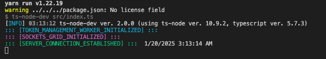
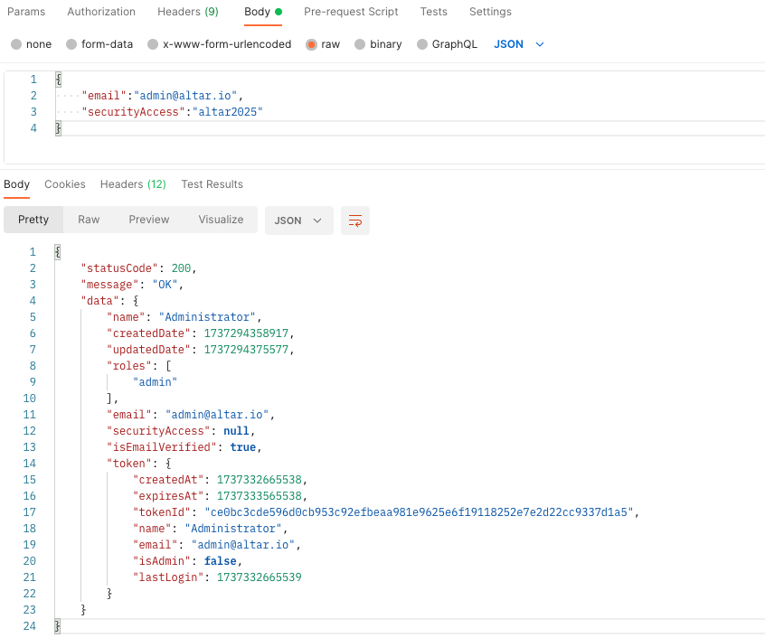

# Altar.IO Senior Fullstack Node.js/Typescript Technical Task

This project is a technical task assignment from Altar.IO for a Senior Fullstack Position (Node.js/Typescript). The objective is to create a grid that will be connected to a WebSocket. The socket will update users with the latest codes and payments made by anyone connected to the socket. API endpoints were created to assist in developing and managing states.

---

## Requirements

- **Node Version**: 22

---

## Instructions

### Development

1. **Install Dependencies**
   - To get started, clone the repository and install the necessary dependencies:
     ```bash
     yarn install
     # or if you're using npm
     npm install
     ```

2. **Create a `.env` File**
   - Create a `.env` file at the root of the project.
   - Update the following keys in the `.env` file:
     - **OBS**: (Ensure that you understand that the secret key has been hashed and saved in mock users for testing purposes only. Changing the secret key will likely cause errors during authentication.)
     ```bash
     TP_NODE_ENV=<staging | production>
     PORT=<your_desired_port_number>
     TP_GRID_SOCKET_PORT=3210
     TP_HASH_SECRET_KEY="altario"
     TP_TOKEN_EXPIRATION_TIME=900 #SECONDS
     TP_GRID_REFRESH_TIME=2 #SECONDS
     TP_PAYMENTS_REFRESH_TIME=5 #SECONDS   
     TP_DEFAULT_WORKER_INTERVAL_TIME=900 #SECONDS
     TP_BASE_FRONTEND_URL="http://localhost:3000/"   
     ```

3. **Start the Application**
   - You can run the app locally using either of the following commands:
     ```bash
     yarn start
     # or if you're using npm
     npm run start
     ```

4. **You're All Set!**
   - Your application should now be running locally.
---
   

### Endpoints Available

- **POST /api/users/auth**: Authenticate a user.
- **POST /api/users/auth/logout/:id**: Logout a user by their ID.
- **POST /api/grids**: Create a new grid.
- **GRID_SOCKET**: A WebSocket endpoint to send updates on grid changes and user payments.

---

## Stage Production

For deployment to production, follow these steps:

1. **Create a Pull Request**
   - Create a pull request to the `main` branch. Any changes to this branch will automatically trigger a GitHub Action that deploys the application to **Heroku**.

2. **Testing Before Deployment**
   - Make sure to thoroughly test your changes locally before pushing them to the `main` branch.
   
3. **Links**
    - Frontend: https://monumental-quokka-0c0ce2.netlify.app/
    - Backend: https://altario-tp-backend-37a40fc15483.herokuapp.com/

---

## Screenshots



---
